<p align="center">
  <h1 align="center">🔍 AgentLens</h1>
  <p align="center">
    <strong>Open-source observability & audit trail for AI agents</strong>
  </p>
  <p align="center">
    <a href="https://pypi.org/project/agentlensai/"></a>
    <a href="https://www.npmjs.com/package/@agentlensai/server"></a>
    <a href="https://www.npmjs.com/package/@agentlensai/mcp"></a>
    <a href="https://opensource.org/licenses/MIT"></a>
    <a href="https://github.com/amitpaz/agentlens/actions"></a>
  </p>
</p>

---

<p align="center">
  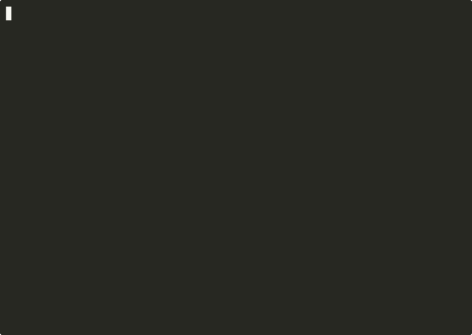
</p>

AgentLens is a **flight recorder for AI agents**. It captures every LLM call, tool invocation, approval decision, and error — then presents it through a queryable API and real-time web dashboard.

**Three ways to integrate — pick what fits your stack:**

| Integration | Language | Effort | Capture |
|---|---|---|---|
| 🐍 **[Python Auto-Instrumentation](#-python-auto-instrumentation)** | Python | **1 line** | Every OpenAI / Anthropic / LangChain call — deterministic |
| 🔌 **[MCP Server](#-mcp-integration)** | Any (MCP) | Config block | Tool calls, sessions, events from Claude Desktop / Cursor |
| 📦 **[SDK](#-programmatic-sdk)** | Python, TypeScript | Code | Full control — log events, query analytics, build integrations |

## ✨ Key Features

- **🐍 Python Auto-Instrumentation** — `agentlensai.init()` and every LLM call across 9 providers (OpenAI, Anthropic, LiteLLM, Bedrock, Vertex, Gemini, Mistral, Cohere, Ollama) is captured automatically. Deterministic — no reliance on LLM behavior.
- **🔌 MCP-Native** — Ships as an MCP server. Agents connect to it like any other tool. Works with Claude Desktop, Cursor, and any MCP client.
- **🧠 LLM Call Tracking** — Full prompt/completion visibility, token usage, cost aggregation, latency measurement, and privacy redaction.
- **📊 Real-Time Dashboard** — Session timelines, event explorer, LLM analytics, cost tracking, and alerting in a beautiful web UI.
- **🔒 Tamper-Evident Audit Trail** — Append-only event storage with SHA-256 hash chains per session. Cryptographically linked and verifiable.
- **💰 Cost Tracking** — Track token usage and estimated costs per session, per agent, per model, over time. Alert on cost spikes.
- **🚨 Alerting** — Configurable rules for error rate, cost threshold, latency anomalies, and inactivity.
- **🔗 AgentKit Ecosystem** — First-class integrations with [AgentGate](https://github.com/amitpaz/agentgate) (approval flows) and [FormBridge](https://github.com/amitpaz/formbridge) (data collection).
- **🧠 Agent Memory** — Semantic recall, lessons learned, pattern reflection, and cross-session context. Agents can search past experience, save insights, analyze their own behavior, and carry context across sessions.
- **🔒 Tenant Isolation** — Multi-tenant support with per-tenant data scoping, API key binding, and embedding isolation.
- **❤️‍🩹 Health Scores** — 5-dimension health scoring (error rate, cost efficiency, tool success, latency, completion rate) with trend tracking. Monitor agent reliability at a glance.
- **💡 Cost Optimization** — Complexity-aware model recommendation engine. Classifies LLM calls by complexity tier and suggests cheaper alternatives with projected savings.
- **📼 Session Replay** — Step-through any past session with full context reconstruction — LLM history, tool results, cost accumulation, and error tracking at every step.
- **⚖️ A/B Benchmarking** — Statistical comparison of agent variants using Welch's t-test and chi-squared analysis across 8 metrics. Create experiments, collect data, get p-values.
- **🛡️ Guardrails** — Automated safety rules that monitor error rates, costs, health scores, and custom metrics. Actions include pausing agents, sending webhooks, downgrading models, and applying AgentGate policies. Dry-run mode for safe testing.
- **🔌 Framework Plugins** — Optional plugins for LangChain, CrewAI, AutoGen, and Semantic Kernel. Auto-detection, fail-safe, non-blocking instrumentation with zero code changes.
- **🏠 Self-Hosted** — SQLite by default, no external dependencies. MIT licensed. Your data stays on your infrastructure.

## 📸 Dashboard

AgentLens ships with a real-time web dashboard for monitoring your agents.

### Overview — At-a-Glance Metrics

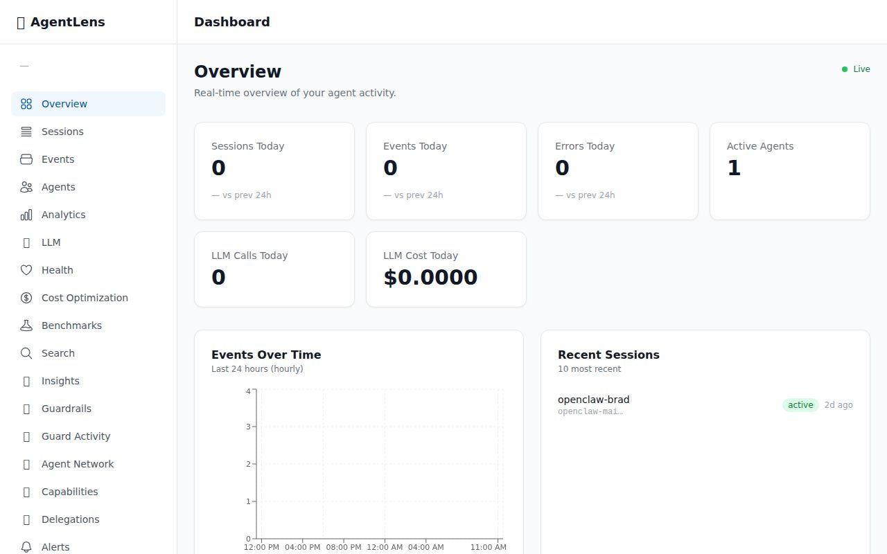

The overview page shows **live metrics** — sessions, events, errors, and active agents — with a 24-hour event timeline chart, recent sessions with status badges (active/completed), and a recent errors feed. Everything updates in real-time via SSE.

### Sessions — Track Every Agent Run

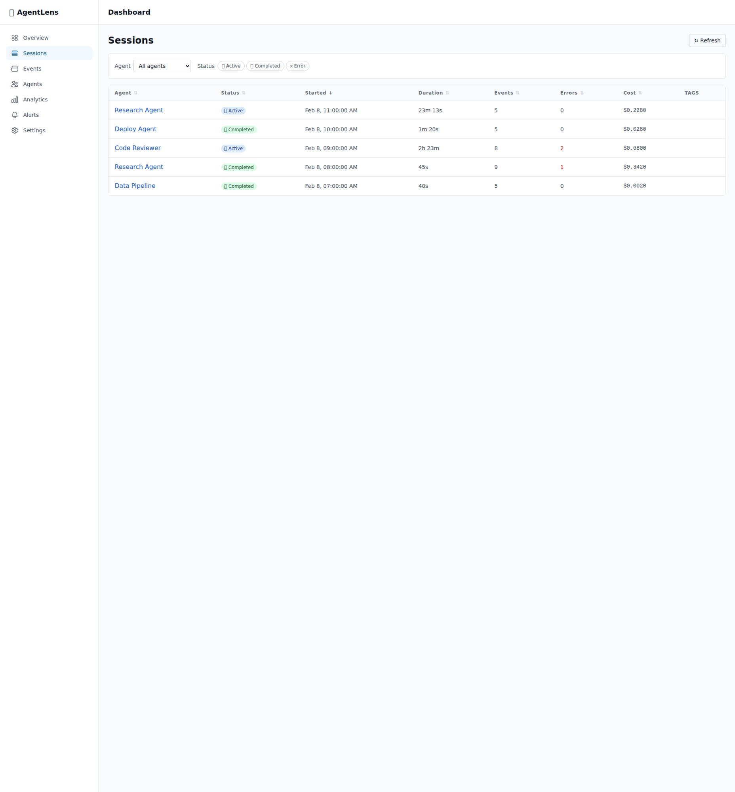

The sessions table shows **every agent session** with sortable columns: agent name, status, start time, duration, event count, error count, and total cost. Filter by agent or status (Active / Completed / Error) to drill down.

### Session Detail — Timeline & Hash Chain

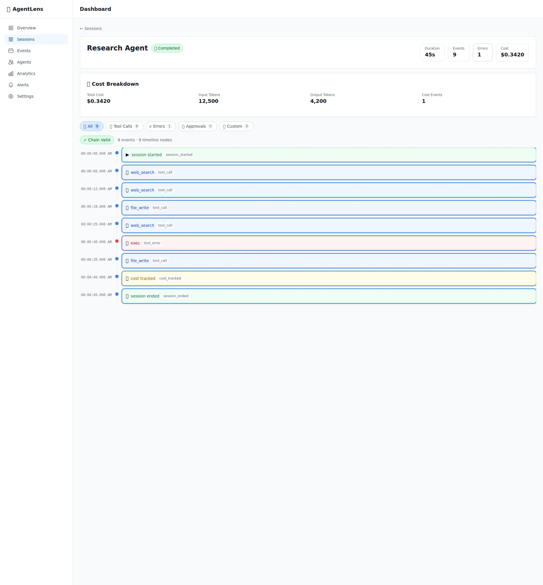

Click into any session to see the **full event timeline** — every tool call, error, cost event, and session lifecycle event in chronological order. The green **✓ Chain Valid** badge confirms the tamper-evident hash chain is intact. Filter by event type (Tool Calls, Errors, Approvals, Custom). Cost breakdown shows token usage and spend.

### Events Explorer — Search & Filter Everything

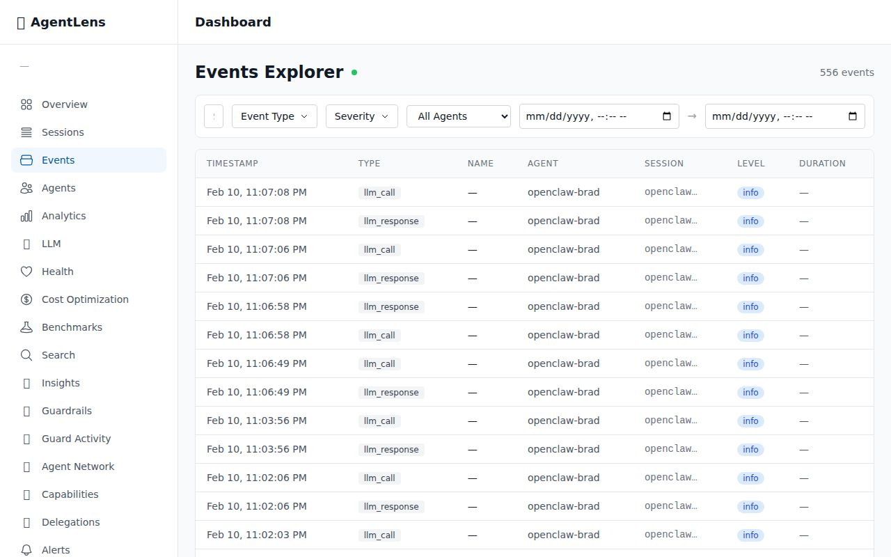

The events explorer gives you a **searchable, filterable view** of every event across all sessions. Filter by event type, severity, agent, or time range. Full-text search works on payload content. Each row shows the tool name, agent, session, severity level, and duration.

### 🧠 LLM Analytics — Prompt & Cost Tracking

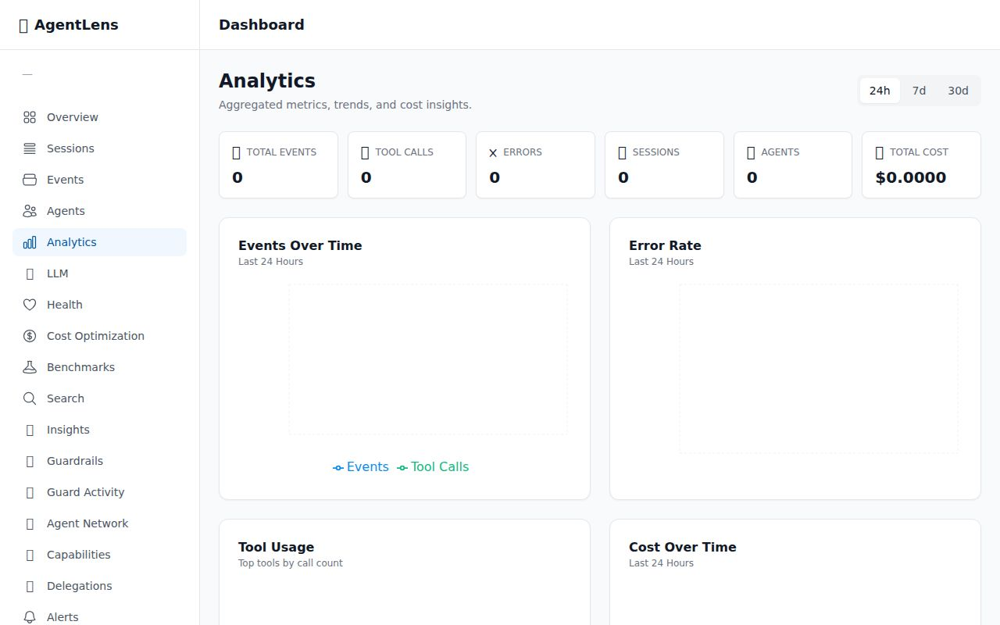

The LLM Analytics page shows **total LLM calls, cost, latency, and token usage** across all agents. Cost and calls over time charts, plus a **model comparison table** breaking down usage by provider and model (Anthropic, OpenAI, Google). Filter by agent, provider, or model.

### 🧠 Session Timeline — LLM Call Pairing

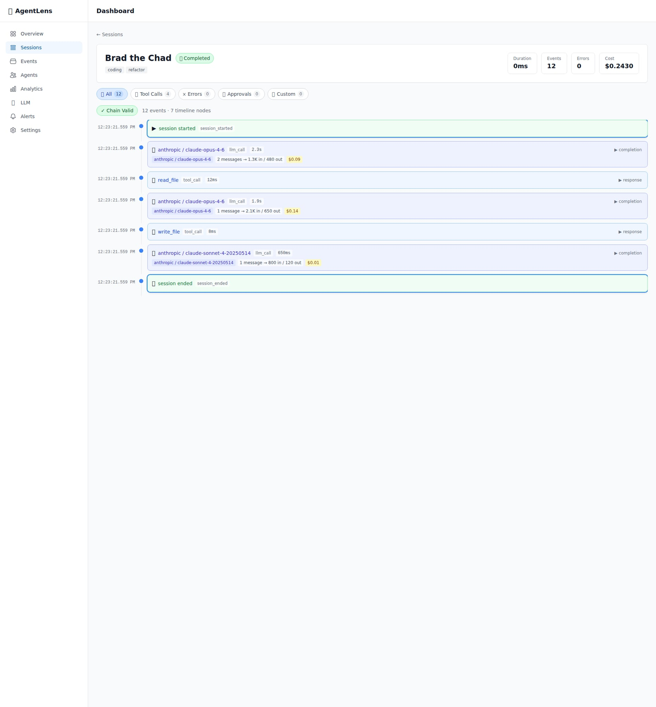

LLM calls appear in the session timeline with **🧠 icons and indigo styling**, paired with their completions by `callId`. Each node shows the model, message count, token usage (in/out), cost badge, and latency. Tool calls and LLM calls are interleaved chronologically — see exactly what the agent thought, then did.

### 💬 Prompt Detail — Chat Bubble Viewer

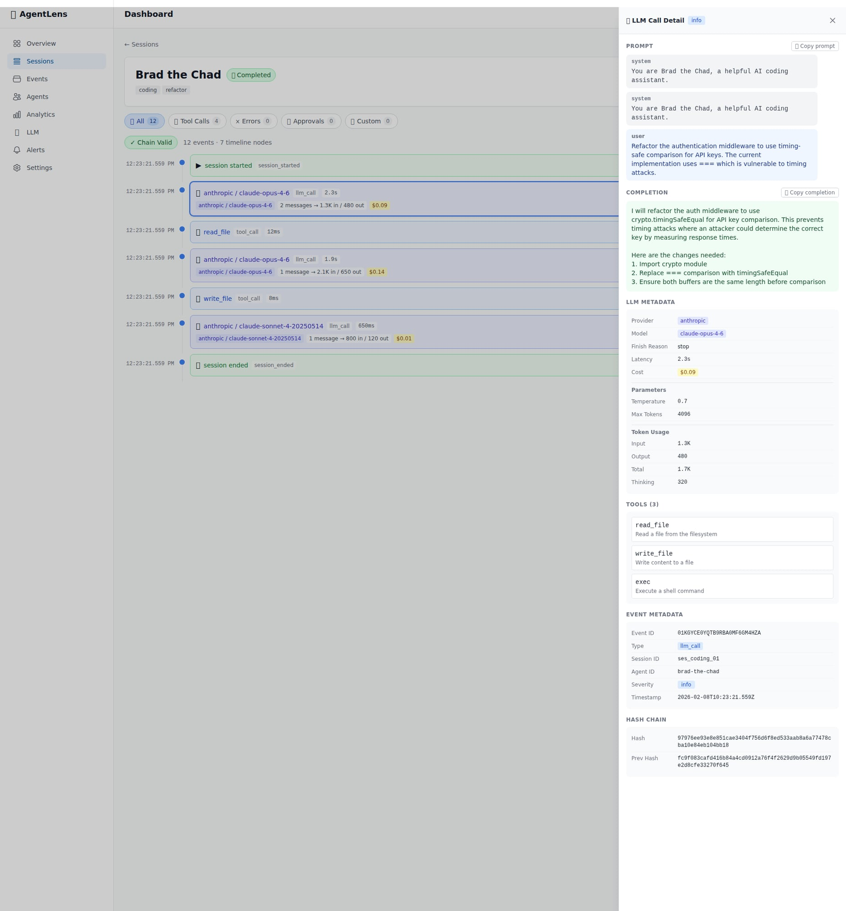

Click any LLM call to see the **full prompt and completion** in a chat-bubble style viewer. System, user, assistant, and tool messages each get distinct styling. The metadata panel shows provider, model, parameters (temperature, max tokens), token breakdown (input/output/thinking/cache), cost, latency, tools provided to the model, and the tamper-evident hash chain.

### ❤️‍🩹 Health Overview — Agent Reliability at a Glance

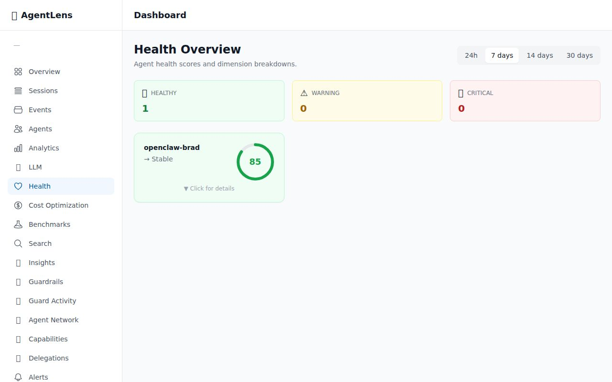

The Health Overview page shows a **5-dimension health score** (0–100) for every agent: error rate, cost efficiency, tool success, latency, and completion rate. Each dimension is scored independently and combined into a weighted overall score. Trend arrows (↑ improving, → stable, ↓ degrading) show direction over time. Click any agent to see a historical sparkline of their score.

### 💡 Cost Optimization — Model Recommendations


The Cost Optimization page analyzes your **LLM call patterns** and recommends cheaper model alternatives. Calls are classified by complexity tier (simple / moderate / complex), and the recommendation engine suggests where you can safely downgrade — e.g., "Switch gpt-4o → gpt-4o-mini for SIMPLE tasks, saving $89/month." Confidence levels and success rate comparisons are shown for each recommendation.

### 📼 Session Replay — Step-Through Debugger

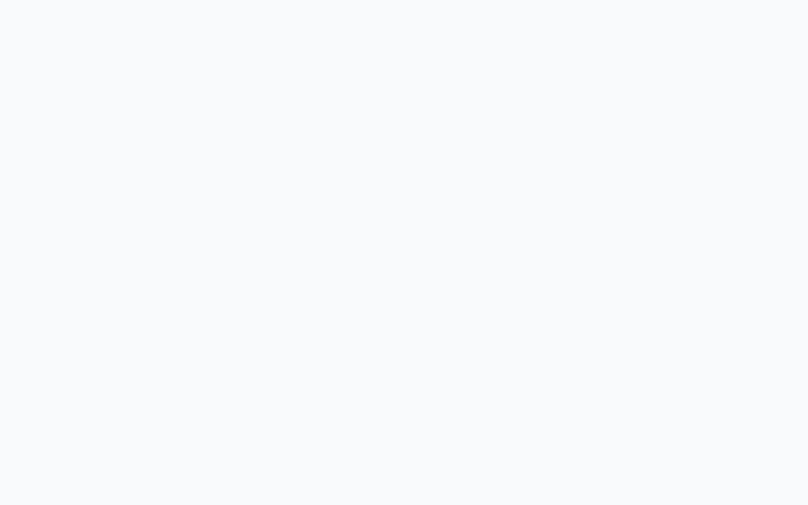

Session Replay lets you **step through any past session** event by event with full context reconstruction. A scrubber/timeline control moves through steps chronologically. At each step, the context panel shows cumulative cost, LLM conversation history, tool call results, pending approvals, and error count. Filter by event type, jump to specific steps, or replay just the summary.

### ⚖️ Benchmarks — A/B Testing for Agents

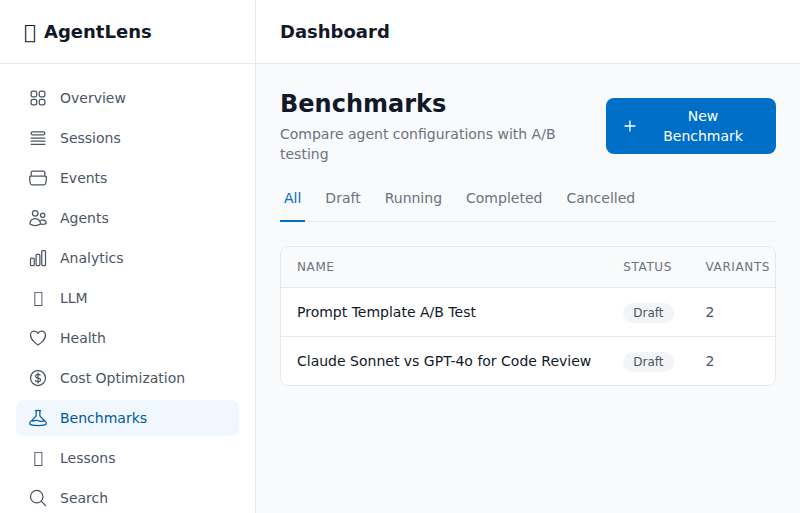

The Benchmarks page lets you **create and manage A/B experiments** comparing agent variants. Define 2–10 variants with session tags, pick metrics (cost, latency, error rate, success rate, tokens, duration), and collect data. Results include per-variant statistics, Welch's t-test p-values, confidence stars (★ ★★ ★★★), and distribution charts. The full workflow — draft → running → completed — is managed from the dashboard.

### 🛡️ Guardrails — Automated Safety Rules


The Guardrails page lets you **create and manage automated safety rules** that monitor error rates, costs, health scores, and custom metrics. Each rule has a condition, action, cooldown, and optional dry-run mode. The list shows trigger counts and last triggered time. Click any rule for the detail page with full configuration, runtime state, and trigger history. The Activity Feed shows a real-time log of all triggers across all rules with filtering by agent and rule.

## 🏗️ Architecture

```
┌───────────────────────────────────────────────────────────────────┐
│  Your AI Agents                                                   │
│                                                                   │
│  ┌──────────────────┐  ┌──────────────────┐  ┌────────────────┐  │
│  │  Python App       │  │  MCP Client       │  │  TypeScript    │  │
│  │  (OpenAI,         │  │  (Claude Desktop,  │  │  App           │  │
│  │   Anthropic,      │  │   Cursor, etc.)    │  │                │  │
│  │   LangChain)      │  │                    │  │                │  │
│  └────────┬─────────┘  └────────┬───────────┘  └───────┬────────┘  │
│           │                     │                       │          │
│    agentlensai.init()    MCP Protocol (stdio)    @agentlensai/sdk │
│    Auto-instrumentation         │                       │          │
│           │              ┌──────┴───────────┐           │          │
│           │              │ @agentlensai/mcp │           │          │
│           │              └──────┬───────────┘           │          │
│           │                     │                       │          │
│           └─────────────────────┼───────────────────────┘          │
│                                 │                                  │
│                          HTTP REST API                             │
└─────────────────────────────────┼──────────────────────────────────┘
                                  ▼
┌──────────────────────────────────────────────────────────────────┐
│              @agentlensai/server                                  │
│                                                                   │
│  ┌────────────┐ ┌────────────┐ ┌────────────┐ ┌──────────────┐  │
│  │  Ingest    │ │   Query    │ │   Alert    │ │  LLM         │  │
│  │  Engine    │ │   Engine   │ │   Engine   │ │  Analytics   │  │
│  └─────┬──────┘ └─────┬──────┘ └────────────┘ └──────────────┘  │
│        └───────────────┘                                         │
│  ┌────────────┐ ┌────────────┐ ┌────────────┐ ┌──────────────┐  │
│  │  Recall    │ │  Lessons   │ │  Reflect   │ │  Context     │  │
│  │ (Semantic) │ │ (Knowledge)│ │ (Patterns) │ │ (X-Session)  │  │
│  └────────────┘ └────────────┘ └────────────┘ └──────────────┘  │
│  ┌────────────┐ ┌────────────┐ ┌────────────┐ ┌──────────────┐  │
│  │  Health    │ │   Cost     │ │  Session   │ │  Benchmark   │  │
│  │  Scoring   │ │  Optimizer │ │  Replay    │ │  Engine      │  │
│  └────────────┘ └────────────┘ └────────────┘ └──────────────┘  │
│               │                                                   │
│        ┌──────┴──────┐         ┌─────────────┐                   │
│        │   SQLite    │         │  Dashboard  │                   │
│        │  (append    │         │  React SPA  │                   │
│        │   only)     │         │  (served    │                   │
│        └─────────────┘         │   at /)     │                   │
│                                └─────────────┘                   │
└──────────────────────────────────────────────────────────────────┘

  Integrations:  AgentGate ──┐
                 FormBridge ─┤──► POST /api/events/ingest
                 Generic ────┘     (HMAC-SHA256 verified)
```

## 🚀 Quick Start

### 1. Start the Server

```bash
npx @agentlensai/server
```

Opens on **http://localhost:3400** with SQLite — zero config.

### 2. Create an API Key

```bash
curl -X POST http://localhost:3400/api/keys \
  -H "Content-Type: application/json" \
  -d '{"name": "my-agent"}'
```

Save the `als_...` key from the response — it's shown only once.

### 3. Instrument Your Agent

#### 🐍 Python Auto-Instrumentation

One line — every LLM call captured automatically. **9 providers supported:**
OpenAI, Anthropic, LiteLLM, AWS Bedrock, Google Vertex AI, Google Gemini, Mistral AI, Cohere, and Ollama.

```bash
pip install agentlensai[all-providers]   # all 9 providers
# or pick specific ones:
pip install agentlensai[openai]          # just OpenAI
pip install agentlensai[bedrock,ollama]  # Bedrock + Ollama
```

```python
import agentlensai

agentlensai.init(
    url="http://localhost:3400",
    api_key="als_your_key",
    agent_id="my-agent",
)

# Every LLM call is now captured automatically (all installed providers)
import openai
client = openai.OpenAI()
response = client.chat.completions.create(
    model="gpt-4o",
    messages=[{"role": "user", "content": "Hello!"}],
)
# ^ Logged: model, tokens, cost, latency, full prompt/completion

# Works with Anthropic too
import anthropic
client = anthropic.Anthropic()
message = client.messages.create(
    model="claude-sonnet-4-20250514",
    max_tokens=1024,
    messages=[{"role": "user", "content": "Hello!"}],
)
# ^ Also captured automatically

# LangChain? Use the callback handler:
from agentlensai.integrations.langchain import AgentLensCallbackHandler
chain.invoke(input, config={"callbacks": [AgentLensCallbackHandler()]})

agentlensai.shutdown()  # flush remaining events
```

**Key guarantees:**
- ✅ **Deterministic** — every call captured, not dependent on LLM choosing to log
- ✅ **Fail-safe** — if the server is down, your code works normally
- ✅ **Non-blocking** — events sent via background thread
- ✅ **Privacy** — `init(redact=True)` strips content, keeps metadata

#### 🔌 MCP Integration

For Claude Desktop, Cursor, or any MCP client — zero code changes:

**Claude Desktop** (`claude_desktop_config.json`):

```json
{
  "mcpServers": {
    "agentlens": {
      "command": "npx",
      "args": ["@agentlensai/mcp"],
      "env": {
        "AGENTLENS_API_URL": "http://localhost:3400",
        "AGENTLENS_API_KEY": "als_your_key_here"
      }
    }
  }
}
```

**Cursor** (`.cursor/mcp.json`):

```json
{
  "mcpServers": {
    "agentlens": {
      "command": "npx",
      "args": ["@agentlensai/mcp"],
      "env": {
        "AGENTLENS_API_URL": "http://localhost:3400",
        "AGENTLENS_API_KEY": "als_your_key_here"
      }
    }
  }
}
```

#### 📦 Programmatic SDK

For full control — log events, query analytics, build integrations:

**Python:**
```bash
pip install agentlensai
```

```python
from agentlensai import AgentLensClient

client = AgentLensClient("http://localhost:3400", api_key="als_your_key")
sessions = client.get_sessions()
analytics = client.get_llm_analytics()
print(f"Total cost: ${analytics.summary.total_cost_usd:.2f}")

# Health scores & optimization (v0.6.0+)
health = client.get_health("my-agent", window=7)
overview = client.get_health_overview()
history = client.get_health_history("my-agent", days=30)
recs = client.get_optimization_recommendations(period=7)

client.close()
```

**TypeScript:**
```bash
npm install @agentlensai/sdk
```

```typescript
import { AgentLensClient } from '@agentlensai/sdk';

const client = new AgentLensClient({
  baseUrl: 'http://localhost:3400',
  apiKey: 'als_your_key',
});
const sessions = await client.getSessions();
const analytics = await client.getLlmAnalytics();
```

### 4. Open the Dashboard

Navigate to **http://localhost:3400** — see sessions, timelines, analytics, and alerts in real time.

## 🧠 Agent Memory

AgentLens ships **14 MCP tools** — 5 core observability tools, 4 for memory and self-improvement, 4 for analytics, and 1 for safety:

#### Core Observability

| Tool | Purpose | Description |
|---|---|---|
| `agentlens_session_start` | **Start Session** | Begin a new observability session for an agent run. Returns a session ID for correlating subsequent events. |
| `agentlens_log_event` | **Log Event** | Record a custom event (tool call, error, approval, etc.) into the current session timeline. |
| `agentlens_log_llm_call` | **Log LLM Call** | Record an LLM call with model, messages, tokens, cost, and latency. Pairs with completions via `callId`. |
| `agentlens_query_events` | **Query Events** | Search and filter events across sessions by type, severity, agent, time range, and payload content. |
| `agentlens_session_end` | **End Session** | Close the current session, flush pending events, and finalize the hash chain. |

#### Intelligence & Analytics

| Tool | Purpose | Description |
|---|---|---|
| `agentlens_recall` | **Semantic Search** | Search past events, sessions, and lessons by meaning. Use before starting tasks to find relevant history. |
| `agentlens_learn` | **Lessons Learned** | Save, retrieve, update, and search distilled insights. Build a persistent knowledge base across sessions. |
| `agentlens_reflect` | **Pattern Analysis** | Analyze behavioral patterns — recurring errors, cost trends, tool sequences, performance changes. |
| `agentlens_context` | **Cross-Session Context** | Retrieve topic-focused history with session summaries, key events, and related lessons ranked by relevance. |
| `agentlens_health` | **Health Scores** | Check the agent's 5-dimension health score (0–100) with trend tracking. Dimensions: error rate, cost efficiency, tool success, latency, completion rate. |
| `agentlens_optimize` | **Cost Optimization** | Get model switch recommendations with projected monthly savings. Analyzes call complexity and suggests cheaper alternatives. |
| `agentlens_replay` | **Session Replay** | Replay a past session as a structured timeline with numbered steps, context annotations, and cost accumulation. |
| `agentlens_benchmark` | **A/B Benchmarking** | Create, manage, and analyze A/B experiments comparing agent variants with statistical significance testing. |
| `agentlens_guardrails` | **Guardrails** | Create, list, and manage automated safety rules — conditions, actions, cooldowns, dry-run mode, and trigger history. |

These tools are automatically available when using the MCP server. Agents can also access the underlying REST API directly via the SDK:

```typescript
// Recall — semantic search
const results = await client.recall({ query: 'authentication errors', scope: 'events' });

// Learn — save a lesson
await client.createLesson({ title: 'Fix for timeout', content: 'Add retry with backoff', category: 'debugging' });

// Reflect — analyze patterns
const analysis = await client.reflect({ analysis: 'error_patterns', agentId: 'my-agent' });

// Context — cross-session history
const context = await client.getContext({ topic: 'database migrations', limit: 5 });
```

See the [Agent Memory Guide](./docs/guide/agent-memory.md) for integration patterns and best practices.

## 🌐 Agent Memory Sharing & Discovery (v0.9.0)

Share lessons across tenants and discover capable agents — with **zero-trust privacy**:

- **Community Sharing** — Share redacted lessons to a community pool. A 6-layer redaction pipeline (secrets, PII, URLs, tenant info, deny-lists, human review) ensures no sensitive data leaves your tenant.
- **Agent Discovery** — Register capabilities, discover agents with matching skills, ranked by trust score, cost, and latency.
- **Task Delegation** — 4-phase protocol (request→accept→execute→return) with automatic fallback, rate limiting, and trust verification.
- **Privacy by Design** — Rotating anonymous IDs, branded types (compile-time safety), fail-closed redaction, kill switch for instant data purge.

### 🔄 Sharing Controls — Configure What Gets Shared

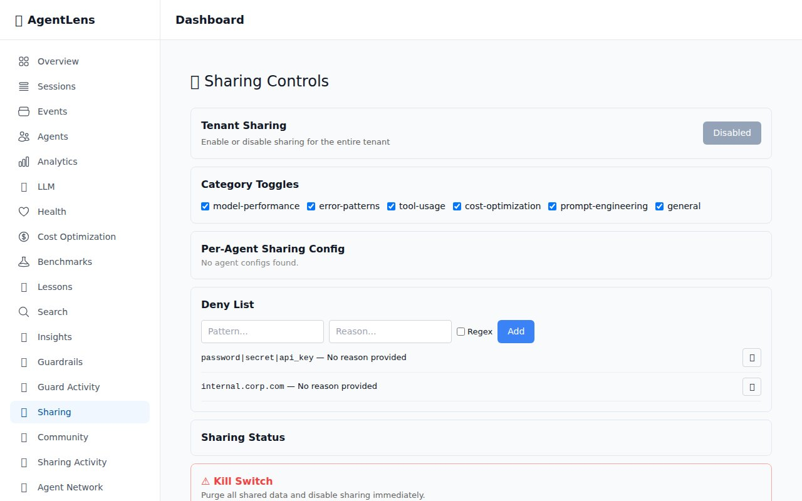

The Sharing Controls page lets you **enable/disable community sharing**, toggle categories (error-patterns, security, performance, etc.), configure per-agent sharing rules, and manage a deny-list of patterns that get stripped before sharing. The **Kill Switch** instantly purges all shared data.

### 🌍 Community Browser — Discover Shared Lessons

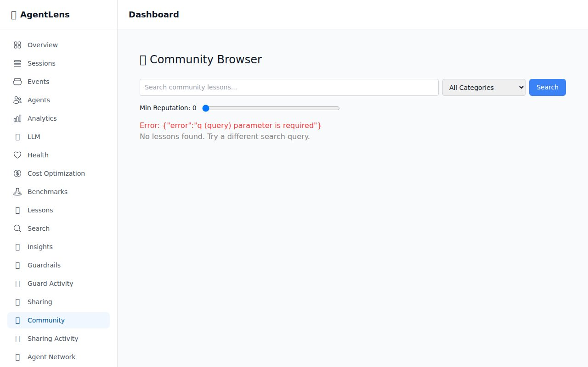

Browse and search the **community lesson pool** — shared lessons from other tenants, fully redacted through the 6-layer pipeline. Filter by category, search by keyword, and import useful patterns into your own agent's memory.

### 📡 Sharing Activity — Audit Trail

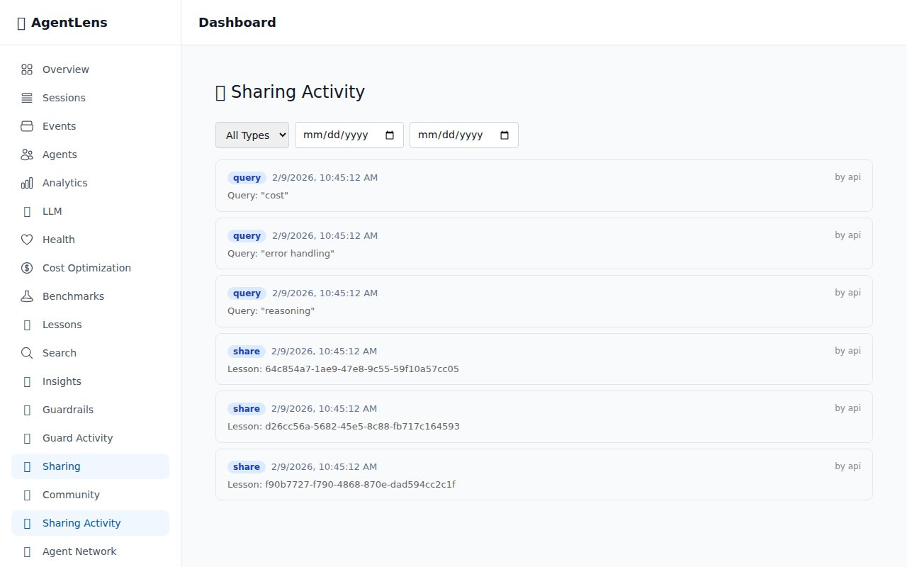

The Sharing Activity feed shows a **real-time log of all sharing events** — what was shared, when, which redaction layers were applied, and the result. Full audit trail for compliance.

### 🕸️ Agent Network — Discovery & Trust

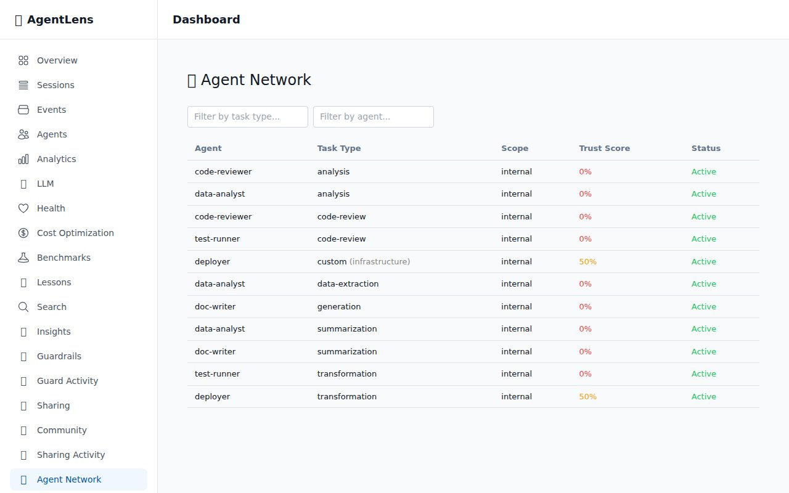

The Agent Network page visualizes **available agents and their capabilities**, ranked by trust score, cost, and latency. Discover agents that can handle specific task types and see their performance history.

### 📋 Capability Registry

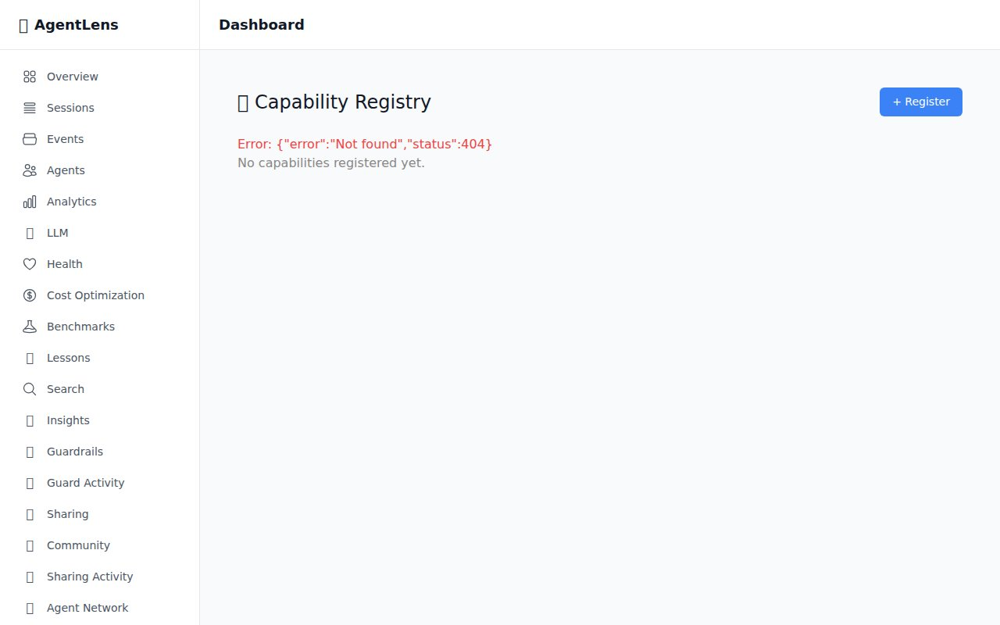

Register and browse **agent capabilities** — what each agent can do, their task types, concurrency limits, and cost per task.

### 📬 Delegation Log — Task Handoffs

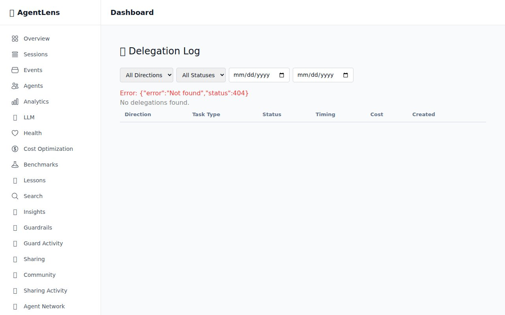

The Delegation Log tracks the **4-phase delegation protocol** (request → accept → execute → return) with status, assigned agent, timing, and fallback history.

### 🎬 v0.9.0 CLI Demo

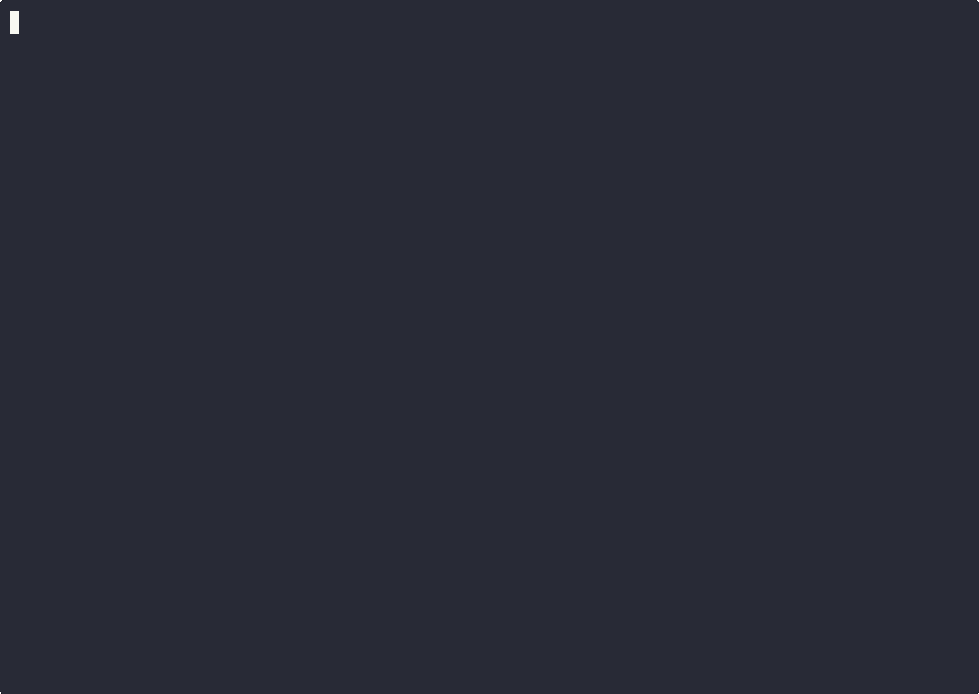

> Community sharing, agent discovery, task delegation, and trust scores — all from the CLI. ([View cast file](demo/demo-v0.9.cast))

**Quick links:**
- [Sharing Setup Guide](./docs/sharing-setup.md) — Enable sharing, configure categories and deny-lists
- [Privacy Controls](./docs/privacy-controls.md) — Redaction pipeline, anonymous IDs, kill switch, audit trail
- [Discovery & Delegation](./docs/discovery-delegation.md) — Register capabilities, discover agents, delegate tasks
- [Privacy Architecture](./docs/privacy-architecture.md) — Technical deep-dive into the 6-layer pipeline
- [Custom Redaction Plugins](./docs/redaction-plugin.md) — Write custom redaction layers
- [API Reference v0.9](./docs/api-reference-v0.9.md) — All new REST endpoints

## 📦 Packages

### Python (PyPI)

| Package | Description | PyPI |
|---|---|---|
| [`agentlensai`](./packages/python-sdk) | Python SDK + auto-instrumentation for 9 LLM providers (OpenAI, Anthropic, LiteLLM, Bedrock, Vertex, Gemini, Mistral, Cohere, Ollama) | [](https://pypi.org/project/agentlensai/) |

### TypeScript / Node.js (npm)

| Package | Description | npm |
|---|---|---|
| [`@agentlensai/server`](./packages/server) | Hono API server + dashboard serving | [](https://npmjs.com/package/@agentlensai/server) |
| [`@agentlensai/mcp`](./packages/mcp) | MCP server for agent instrumentation | [](https://npmjs.com/package/@agentlensai/mcp) |
| [`@agentlensai/sdk`](./packages/sdk) | Programmatic TypeScript client | [](https://npmjs.com/package/@agentlensai/sdk) |
| [`@agentlensai/core`](./packages/core) | Shared types, schemas, hash chain utilities | [](https://npmjs.com/package/@agentlensai/core) |
| [`@agentlensai/cli`](./packages/cli) | Command-line interface | [](https://npmjs.com/package/@agentlensai/cli) |
| [`@agentlensai/dashboard`](./packages/dashboard) | React web dashboard (bundled with server) | private |

## 🔌 API Overview

| Endpoint | Description |
|---|---|
| `POST /api/events` | Ingest events (batch) |
| `GET /api/events` | Query events with filters |
| `GET /api/sessions` | List sessions |
| `GET /api/sessions/:id/timeline` | Session timeline with hash chain verification |
| `GET /api/analytics` | Bucketed metrics over time |
| `GET /api/analytics/costs` | Cost breakdown by agent |
| `POST /api/alerts/rules` | Create alert rules |
| `GET /api/recall` | Semantic search over agent memory |
| `POST /api/lessons` | Create a lesson |
| `GET /api/lessons` | List/search lessons |
| `GET /api/reflect` | Pattern analysis (errors, costs, tools, performance) |
| `GET /api/context` | Cross-session context retrieval |
| `POST /api/events/ingest` | Webhook ingestion (AgentGate/FormBridge) |
| `GET /api/agents/:id/health` | Agent health score with dimensions |
| `GET /api/health/overview` | Health overview for all agents |
| `GET /api/health/history` | Historical health snapshots |
| `GET /api/optimize/recommendations` | Cost optimization recommendations |
| `GET /api/sessions/:id/replay` | Session replay with context reconstruction |
| `POST /api/benchmarks` | Create a benchmark |
| `GET /api/benchmarks` | List benchmarks |
| `GET /api/benchmarks/:id` | Get benchmark detail |
| `PUT /api/benchmarks/:id/status` | Transition benchmark status |
| `GET /api/benchmarks/:id/results` | Get benchmark comparison results |
| `DELETE /api/benchmarks/:id` | Delete a benchmark |
| `POST /api/guardrails` | Create guardrail rule |
| `GET /api/guardrails` | List guardrail rules |
| `GET /api/guardrails/:id` | Get guardrail rule |
| `PUT /api/guardrails/:id` | Update guardrail rule |
| `DELETE /api/guardrails/:id` | Delete guardrail rule |
| `GET /api/guardrails/history` | List guardrail trigger history |
| `GET /api/agents/:id` | Get agent detail (includes pausedAt, modelOverride) |
| `POST /api/keys` | Create API keys |

[Full API Reference →](./docs/reference/api.md)

## 🔗 Part of the AgentKit Suite

AgentLens works alongside two companion projects for unified agent lifecycle management:

| Project | Role | Link |
|---|---|---|
| **AgentGate** | Human-in-the-loop approval gateway | [github.com/amitpaz/agentgate](https://github.com/amitpaz/agentgate) |
| **FormBridge** | Structured data collection from humans | [github.com/amitpaz/formbridge](https://github.com/amitpaz/formbridge) |
| **AgentLens** | Observability & audit trail | You are here |

Together: **data collection → approvals → observability**.

Approval events from AgentGate and form submissions from FormBridge appear directly in AgentLens session timelines, giving you a single view of the complete agent lifecycle.

## ⌨️ CLI

The `@agentlensai/cli` package provides command-line access to key features:

```bash
npx @agentlensai/cli health                          # Overview of all agents
npx @agentlensai/cli health --agent my-agent          # Detailed health with dimensions
npx @agentlensai/cli health --agent my-agent --history # Score trend over time
npx @agentlensai/cli optimize                          # Cost optimization recommendations
npx @agentlensai/cli optimize --agent my-agent --period 7
```

Both commands support `--format json` for machine-readable output. See `agentlens health --help` and `agentlens optimize --help` for all options.

## 🛠️ Development

```bash
# Clone and install
git clone https://github.com/amitpaz/agentlens.git
cd agentlens
pnpm install

# Run all checks
pnpm typecheck
pnpm test
pnpm lint

# Start dev server
pnpm dev
```

### Requirements

- Node.js ≥ 20.0.0
- pnpm ≥ 10.0.0

## 📄 License

[MIT](LICENSE) © [Amit Paz](https://github.com/amitpaz)
