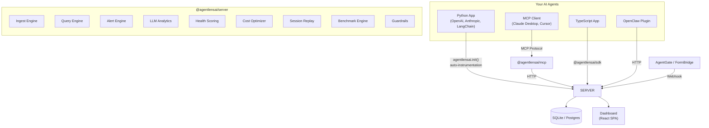

<p align="center">
  <h1 align="center">🔍 AgentLens</h1>
  <p align="center">
    <strong>Open-source observability & audit trail for AI agents</strong>
  </p>
  <p align="center">
    <a href="https://pypi.org/project/agentlensai/"></a>
    <a href="https://www.npmjs.com/package/@agentlensai/server"></a>
    <a href="https://www.npmjs.com/package/@agentlensai/mcp"></a>
    <a href="https://opensource.org/licenses/MIT"></a>
    <a href="https://github.com/agentkitai/agentlens/actions"></a>
    <!-- TODO: Add Docker badge when image is published to GHCR/Docker Hub -->
    <!-- <a href="https://ghcr.io/agentkitai/agentlens"></a> -->
  </p>
  <p align="center">
    <a href="./docs/">📖 Documentation</a> · <a href="#-quick-start">Quick Start</a> · <a href="#-dashboard">Dashboard</a> · <a href="https://app.agentlens.ai">☁️ Cloud</a>
  </p>
</p>

---

## 📑 Table of Contents

- [Quick Start](#-quick-start)
- [Architecture](#-architecture)
- [Integration Guides](#-integration-guides)
- [Key Features](#-key-features)
- [Dashboard](#-dashboard)
- [AgentLens Cloud](#-agentlens-cloud)
- [Packages](#-packages)
- [API Overview](#-api-overview)
- [CLI](#-cli)
- [Development](#-development)
- [Contributing](#-contributing)
- [AgentKit Ecosystem](#-agentkit-ecosystem)
- [License](#-license)

---

AgentLens is a **flight recorder for AI agents**. It captures every LLM call, tool invocation, approval decision, and error — then presents it through a queryable API and real-time web dashboard.

**Four ways to integrate — pick what fits your stack:**

| Integration | Language | Effort | Capture |
|---|---|---|---|
| 🤖 **[OpenClaw Plugin](#-openclaw-plugin)** | [OpenClaw](https://github.com/openclaw/openclaw) | **Copy & enable** | Every Anthropic call — prompts, tokens, cost, tools — zero code |
| 🐍 **[Python Auto-Instrumentation](#-python-auto-instrumentation)** | Python | **1 line** | Every OpenAI / Anthropic / LangChain call — deterministic |
| 🔌 **[MCP Server](#-mcp-integration)** | Any (MCP) | Config block | Tool calls, sessions, events from Claude Desktop / Cursor |
| 📦 **[SDK](#-programmatic-sdk)** | Python, TypeScript | Code | Full control — log events, query analytics, build integrations |

## 🚀 Quick Start

### Docker (recommended)

```bash
git clone https://github.com/agentkitai/agentlens
cd agentlens
cp .env.example .env
docker compose up
# Open http://localhost:3000
```

For production (auth enabled, Stripe, TLS):
```bash
docker compose -f docker-compose.yml -f docker-compose.prod.yml up
```

### Without Docker

```bash
npx @agentlensai/server
# Opens on http://localhost:3400 with SQLite — zero config
```

### Create an API Key

```bash
curl -X POST http://localhost:3400/api/keys \
  -H "Content-Type: application/json" \
  -d '{"name": "my-agent"}'
```

Save the `als_...` key from the response — it's shown only once. Then head to the [Integration Guides](#-integration-guides) to instrument your agent.

📖 [Full setup guide →](./docs/guide/)

## 🏗️ Architecture



## 🔧 Integration Guides

### 🤖 OpenClaw Plugin

If you're running [OpenClaw](https://github.com/openclaw/openclaw), the AgentLens plugin captures every Anthropic API call automatically — prompts, completions, token usage, costs, latency, and tool calls.

```bash
cp -r packages/openclaw-plugin /usr/lib/node_modules/openclaw/extensions/agentlens-relay
openclaw config patch '{"plugins":{"entries":{"agentlens-relay":{"enabled":true}}}}'
openclaw gateway restart
```

Set `AGENTLENS_URL` if your AgentLens instance isn't on `localhost:3000`. See the [plugin README](./packages/openclaw-plugin/README.md) for details.

### 🐍 Python Auto-Instrumentation

One line — every LLM call captured automatically across **9 providers** (OpenAI, Anthropic, LiteLLM, AWS Bedrock, Google Vertex AI, Google Gemini, Mistral AI, Cohere, Ollama):

```bash
pip install agentlensai[all-providers]
```

```python
import agentlensai

agentlensai.init(
    url="http://localhost:3400",
    api_key="als_your_key",
    agent_id="my-agent",
)
# Every LLM call is now captured automatically
```

**Key guarantees:** ✅ Deterministic · ✅ Fail-safe · ✅ Non-blocking · ✅ Privacy (`init(redact=True)`)

📖 [Python SDK full docs →](./docs/guide/)

### 🔌 MCP Integration

For Claude Desktop, Cursor, or any MCP client — add to your config:

```json
{
  "mcpServers": {
    "agentlens": {
      "command": "npx",
      "args": ["@agentlensai/mcp"],
      "env": {
        "AGENTLENS_API_URL": "http://localhost:3400",
        "AGENTLENS_API_KEY": "als_your_key_here"
      }
    }
  }
}
```

AgentLens ships **12 MCP tools** — 5 core observability, 3 intelligence & analytics, 4 operations. [Full MCP tool reference →](./docs/reference/api.md)

📖 [MCP setup guide →](./docs/guide/)

### 📦 Programmatic SDK

**Python:**
```bash
pip install agentlensai
```
```python
from agentlensai import AgentLensClient
client = AgentLensClient("http://localhost:3400", api_key="als_your_key")
sessions = client.get_sessions()
analytics = client.get_llm_analytics()
```

**TypeScript:**
```bash
npm install @agentlensai/sdk
```
```typescript
import { AgentLensClient } from '@agentlensai/sdk';
const client = new AgentLensClient({ baseUrl: 'http://localhost:3400', apiKey: 'als_your_key' });
const sessions = await client.getSessions();
```

📖 [SDK reference →](./docs/reference/api.md)

## ✨ Key Features

- **🐍 Python Auto-Instrumentation** — `agentlensai.init()` captures every LLM call across 9 providers automatically. Deterministic — no reliance on LLM behavior.
- **🔌 MCP-Native** — Ships as an MCP server. Works with Claude Desktop, Cursor, and any MCP client.
- **🧠 LLM Call Tracking** — Full prompt/completion visibility, token usage, cost aggregation, latency measurement, and privacy redaction.
- **📊 Real-Time Dashboard** — Session timelines, event explorer, LLM analytics, cost tracking, and alerting.
- **🔒 Tamper-Evident Audit Trail** — Append-only event storage with SHA-256 hash chains per session.
- **💰 Cost Tracking** — Track token usage and estimated costs per session, per agent, per model. Alert on cost spikes.
- **🚨 Alerting** — Configurable rules for error rate, cost threshold, latency anomalies, and inactivity.
- **❤️‍🩹 Health Scores** — 5-dimension health scoring with trend tracking.
- **💡 Cost Optimization** — Complexity-aware model recommendation engine with projected savings.
- **📼 Session Replay** — Step-through any past session with full context reconstruction.
- **⚖️ A/B Benchmarking** — Statistical comparison of agent variants using Welch's t-test and chi-squared analysis.
- **🛡️ Guardrails** — Automated safety rules with dry-run mode for safe testing.
- **🔌 Framework Plugins** — LangChain, CrewAI, AutoGen, Semantic Kernel — auto-detection, fail-safe, non-blocking.
- **🔗 AgentKit Ecosystem** — Integrations with [AgentGate](https://github.com/agentkitai/agentgate), [FormBridge](https://github.com/agentkitai/formbridge), [Lore](https://github.com/agentkitai/lore), and [AgentEval](https://github.com/agentkitai/agenteval).
- **🔒 Tenant Isolation** — Multi-tenant support with per-tenant data scoping and API key binding.
- **🏠 Self-Hosted** — SQLite by default, no external dependencies. MIT licensed.

## 📸 Dashboard

AgentLens ships with a real-time web dashboard for monitoring your agents.

<details>
<summary>📸 Dashboard Screenshots (click to expand)</summary>

### Overview — At-a-Glance Metrics


The overview page shows **live metrics** — sessions, events, errors, and active agents — with a 24-hour event timeline chart, recent sessions with status badges, and a recent errors feed.

### Sessions — Track Every Agent Run


Every agent session with sortable columns: agent name, status, start time, duration, event count, error count, and total cost.

### Session Detail — Timeline & Hash Chain


Full event timeline with tamper-evident hash chain verification. Filter by event type, view cost breakdown.

### Events Explorer — Search & Filter Everything


Searchable, filterable view of every event across all sessions.

### 🧠 LLM Analytics — Prompt & Cost Tracking


Total LLM calls, cost, latency, and token usage across all agents with model comparison.

### 🧠 Session Timeline — LLM Call Pairing


LLM calls in session timeline with model, tokens, cost, and latency.

### 💬 Prompt Detail — Chat Bubble Viewer


Full prompt and completion in a chat-bubble style viewer with metadata panel.

### ❤️‍🩹 Health Overview — Agent Reliability


5-dimension health score for every agent with trend tracking.

### 💡 Cost Optimization — Model Recommendations


Analyzes LLM call patterns and recommends cheaper model alternatives with confidence levels.

### 📼 Session Replay — Step-Through Debugger


Step through any past session event by event with full context reconstruction.

### ⚖️ Benchmarks — A/B Testing for Agents


Create and manage A/B experiments with statistical significance testing.

### 🛡️ Guardrails — Automated Safety Rules


Create and manage automated safety rules with trigger history and activity feed.

</details>

## ☁️ AgentLens Cloud

Don't want to self-host? **AgentLens Cloud** is a fully managed SaaS — same SDK, zero infrastructure:

```python
import agentlensai
agentlensai.init(cloud=True, api_key="als_cloud_your_key_here", agent_id="my-agent")
```

- **Same SDK, one parameter change** — switch `url=` to `cloud=True`
- **Managed Postgres** — multi-tenant with row-level security
- **Team features** — organizations, RBAC, audit logs, usage billing
- **No server to run** — dashboard at [app.agentlens.ai](https://app.agentlens.ai)

📖 [Cloud Setup Guide](./docs/guide/cloud-setup.md) · [Migration Guide](./docs/guide/cloud-migration.md) · [Troubleshooting](./docs/guide/troubleshooting.md)

## 📦 Packages

### Python (PyPI)

| Package | Description | PyPI |
|---|---|---|
| [`agentlensai`](./packages/python-sdk) | Python SDK + auto-instrumentation for 9 LLM providers | [](https://pypi.org/project/agentlensai/) |

### TypeScript / Node.js (npm)

| Package | Description | npm |
|---|---|---|
| [`@agentlensai/server`](./packages/server) | Hono API server + dashboard serving | [](https://npmjs.com/package/@agentlensai/server) |
| [`@agentlensai/mcp`](./packages/mcp) | MCP server for agent instrumentation | [](https://npmjs.com/package/@agentlensai/mcp) |
| [`@agentlensai/sdk`](./packages/sdk) | Programmatic TypeScript client | [](https://npmjs.com/package/@agentlensai/sdk) |
| [`@agentlensai/core`](./packages/core) | Shared types, schemas, hash chain utilities | [](https://npmjs.com/package/@agentlensai/core) |
| [`@agentlensai/cli`](./packages/cli) | Command-line interface | [](https://npmjs.com/package/@agentlensai/cli) |
| [`@agentlensai/dashboard`](./packages/dashboard) | React web dashboard (bundled with server) | private |

## 🔌 API Overview

| Endpoint | Description |
|---|---|
| `POST /api/events` | Ingest events (batch) |
| `GET /api/events` | Query events with filters |
| `GET /api/sessions` | List sessions |
| `GET /api/sessions/:id/timeline` | Session timeline with hash chain verification |
| `GET /api/analytics` | Bucketed metrics over time |

[Full API Reference →](./docs/reference/api.md)

## ⌨️ CLI

```bash
npx @agentlensai/cli health                          # Overview of all agents
npx @agentlensai/cli health --agent my-agent          # Detailed health with dimensions
npx @agentlensai/cli optimize                          # Cost optimization recommendations
```

Both commands support `--format json` for machine-readable output. See `agentlens health --help` for all options.

## 🛠️ Development

```bash
git clone https://github.com/agentkitai/agentlens.git
cd agentlens
pnpm install

pnpm typecheck && pnpm test && pnpm lint  # Run all checks
pnpm dev                                   # Start dev server
```

**Requirements:** Node.js ≥ 20.0.0 · pnpm ≥ 10.0.0

## 🤝 Contributing

We welcome contributions! See **[CONTRIBUTING.md](CONTRIBUTING.md)** for setup instructions, coding standards, and the PR process.

## 🧰 AgentKit Ecosystem

| Project | Description | |
|---------|-------------|-|
| **AgentLens** | Observability & audit trail for AI agents | ⬅️ you are here |
| [Lore](https://github.com/agentkitai/lore) | Cross-agent memory and lesson sharing | |
| [AgentGate](https://github.com/agentkitai/agentgate) | Human-in-the-loop approval gateway | |
| [FormBridge](https://github.com/agentkitai/formbridge) | Agent-human mixed-mode forms | |
| [AgentEval](https://github.com/agentkitai/agenteval) | Testing & evaluation framework | |
| [agentkit-mesh](https://github.com/agentkitai/agentkit-mesh) | Agent discovery & delegation | |
| [agentkit-cli](https://github.com/agentkitai/agentkit-cli) | Unified CLI orchestrator | |
| [agentkit-guardrails](https://github.com/agentkitai/agentkit-guardrails) | Reactive policy guardrails | |

## 📄 License

[MIT](LICENSE) © [Amit Paz](https://github.com/amitpaz)
